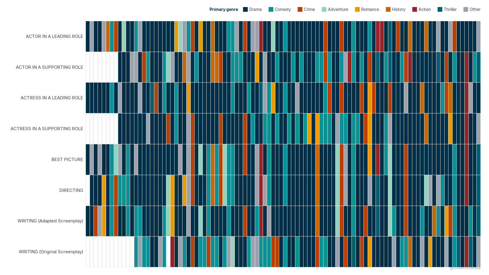
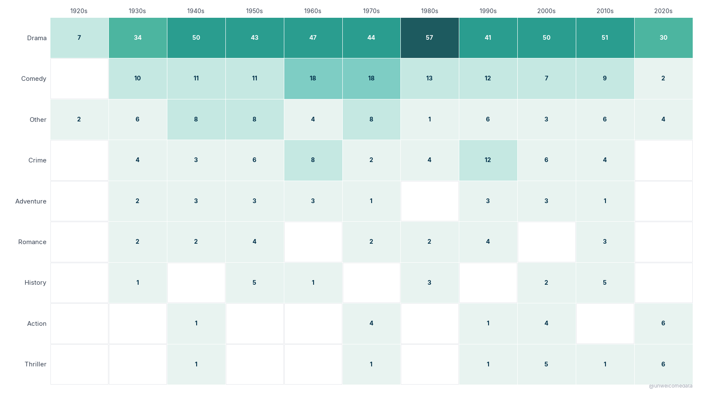
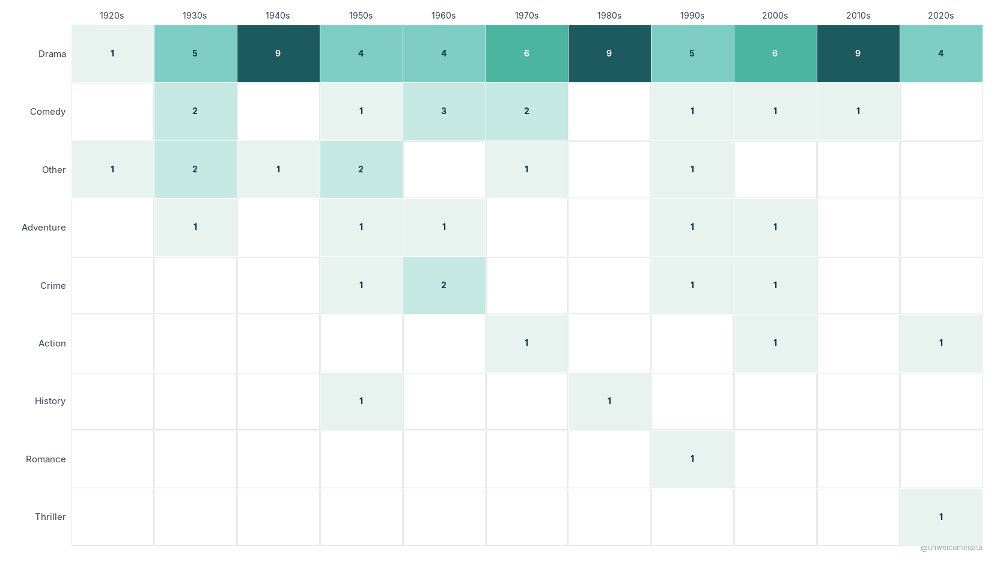

**[@unwelcomedata](https://github.com/unwelcomedata)** · data from public sources

# Oscar wins by genre

Every Oscar winner belongs to a genre — and across 98 ceremonies the Academy has
had a clear favorite. Of the **756 major-award wins** (Best Picture, Directing,
the four acting awards, and the two screenplay awards), roughly **60% went to
films tagged Drama** (~454 of 756). Drama leads in **every single decade**, and
the tilt is sharpest for Best Picture.

---

_Click any chart to open it at full resolution._

## How it was measured

The metric is **major-award WINS**, each colored by (or counted per) the winning
film's **primary genre**. "Major awards" means the eight headline categories:
**Best Picture, Directing, the two leading-acting and two supporting-acting
awards, and the two screenplay awards** (Adapted and Original). Genre comes from
**The Movie Database (TMDB)** — specifically each film's **first listed genre**
(`genres[0]`) — binned to the **top 8 genres plus "Other"** (9 colors). Oscar
nominations and winners are from the **Academy of Motion Picture Arts & Sciences
(AMPAS) Awards Database** (compiled by DLu/oscar_data).

> _This product uses the TMDB API but is not endorsed or certified by TMDB._

Two honest caveats worth keeping in mind as you read the charts:

- **"Primary genre" is a single, first tag.** Many winners are genuinely
  multi-genre, and a film you think of as something else may show up as Drama.
  *The Silence of the Lambs* is commonly tagged Crime / Thriller / Horror;
  *Oppenheimer* is Biography / Drama / History — but each is charted under its one
  TMDB primary genre only.
- **The 2020s is a partial, in-progress decade** — the data runs through the 2025
  ceremony (the 98th), so its lower counts reflect fewer elapsed years, not a
  decline.

## 1. Every major win, by category and year

Each major-award win sits at its (category, year) cell, **colored by the winning
film's primary genre**. There are no numbers in the cells — the color is the
information, and an **empty cell simply means no major win for that category that
year**. The genre-to-color key sits in a single row above the grid.

## 2. Genre wins by decade — all major awards

Each cell is the **count of major-award wins** for a given genre in a given
decade, on a sequential teal scale (hotter = more wins). This counts **all eight
major awards together**. Drama's row runs hot across every decade; the empty cells
are decades with no major win in that genre.

## 3. Genre wins by decade — Best Picture only

Same shape as chart 2, but this one counts **only the 98 Best Picture winners** —
not all major awards. Stripped to Best Picture, the genre signature is tighter and
more selective, but Drama still dominates the frame. (Read this as Best Picture
alone, genre × decade count, sequential teal.)

---

## The data

The full per-win dataset is published here:

- **[oscars_award_wins_v1.csv](export/oscars_award_wins_v1.csv)** — one row per
  winning award, 1st ceremony (1927/28) through the 98th (2025), with ceremony,
  year, decade, award class and category, film, winner, and the TMDB primary
  genre (populated for major-award films).
- **[Codebook](export/oscars_award_wins_v1_codebook.md)** — a plain-English
  description of every column.

## Sources & license

Full attribution and the methodology write-up are in **[SOURCES.md](SOURCES.md)**.

Oscar nominations and winners come from the **AMPAS Awards Database**
(https://awardsdatabase.oscars.org/), compiled with IMDb identifiers by
**[DLu/oscar_data](https://github.com/DLu/oscar_data)** (BSD 2-Clause for the
compilation; underlying facts from AMPAS/IMDb). Film genres are from **The Movie
Database (TMDB)** — _this product uses the TMDB API but is not endorsed or
certified by TMDB_. This is a fun-tier pop-culture project; Oscar and film names
are used nominatively.

---

> **AI-Assisted Development**
> This project was built with the assistance of [Kiro](https://kiro.dev),
> an AI-powered development environment. All data sourcing decisions,
> methodology choices, and published findings are the responsibility of the
> author. AI was used for code generation, data pipeline construction, and
> research assistance — not for analysis conclusions or editorial judgment.
